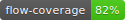

# Zepio | ZEC Wallet

Zepio is a modern cross-platform full-node desktop wallet for the Zcash Network.

[](https://app.bitrise.io/app/e3e2de9d817688f9)


## Stack Information

- [Electron](https://github.com/electron/electron): desktop application builder

- [React](https://facebook.github.io/react/): UI view layer

- [Redux](http://redux.js.org/): predictable state container

- [Webpack](http://webpack.github.io/): module bundler

- [Webpack Development Server](https://webpack.github.io/docs/webpack-dev-server.html): development server

- [Babel](http://babeljs.io/): ES7/JSX transpilling

- [ESLint](http://eslint.org/): code rules and linting

- [React Router](https://github.com/reactjs/react-router): routing solution for react

- [Styled Components](https://www.styled-components.com/): visual primitives for theming applications

## Installation

```bash

yarn install

```

## Development

To run the application you simply need to run

```bash

yarn start

```

This will kickstart the webpack development server and serve the app on port 8080, as well as launch the Electron wrapper for the application, which houses the `zcashd` daemon process.

## License

MIT © Zcash Foundation 2019
